# Architecture Overview

This document provides a detailed overview of the async-cassandra library architecture and how it integrates with the DataStax Cassandra driver.

## Table of Contents

- [Problem Statement](#problem-statement)
- [Solution Architecture](#solution-architecture)
- [Component Overview](#component-overview)
  - [Core Components](#core-components)
  - [Streaming Components](#streaming-components)
  - [Metrics & Monitoring](#metrics--monitoring)
- [Execution Flow](#execution-flow)
  - [Query Execution](#query-execution)
  - [Streaming Execution](#streaming-execution)
  - [Batch Operations](#batch-operations)
- [Performance Considerations](#performance-considerations)
- [Architectural Patterns](#architectural-patterns)

## Problem Statement

The DataStax Cassandra Python driver uses a thread pool for I/O operations, which can create bottlenecks in async applications:

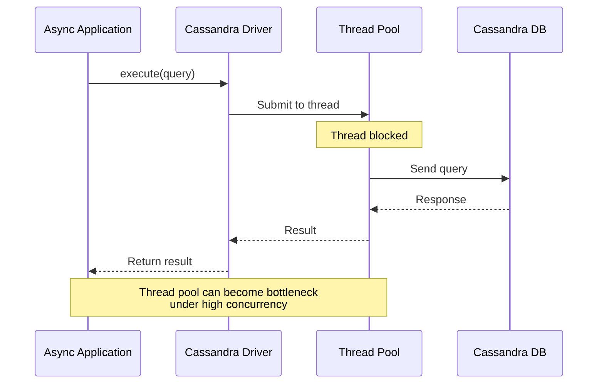
```mermaid
sequenceDiagram
    participant App as Async Application
    participant Driver as Cassandra Driver
    participant ThreadPool as Thread Pool
    participant Cassandra as Cassandra DB

    App->>Driver: execute(query)
    Driver->>ThreadPool: Submit to thread
    Note over ThreadPool: Thread blocked
    ThreadPool->>Cassandra: Send query
    Cassandra-->>ThreadPool: Response
    ThreadPool-->>Driver: Result
    Driver-->>App: Return result
    Note over App,ThreadPool: Thread pool can become bottleneck<br/>under high concurrency
```

## Solution Architecture

async-cassandra wraps the driver's async operations to provide true async/await support:

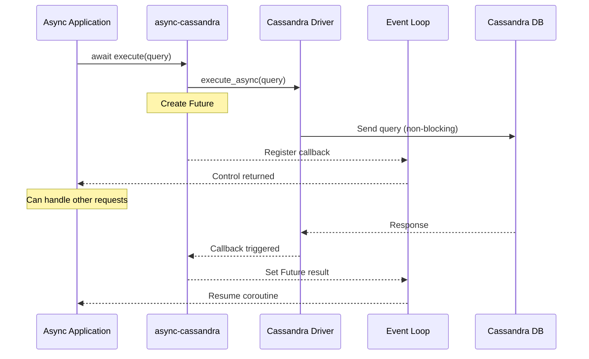
```mermaid
sequenceDiagram
    participant App as Async Application
    participant AsyncWrapper as async-cassandra
    participant Driver as Cassandra Driver
    participant EventLoop as Event Loop
    participant Cassandra as Cassandra DB

    App->>AsyncWrapper: await execute(query)
    AsyncWrapper->>Driver: execute_async(query)
    Note over AsyncWrapper: Create Future
    Driver->>Cassandra: Send query (non-blocking)
    AsyncWrapper-->>EventLoop: Register callback
    EventLoop-->>App: Control returned
    Note over App: Can handle other requests
    Cassandra-->>Driver: Response
    Driver-->>AsyncWrapper: Callback triggered
    AsyncWrapper-->>EventLoop: Set Future result
    EventLoop-->>App: Resume coroutine
```

## Component Overview

### Core Components

#### 1. AsyncCluster

Manages cluster configuration and lifecycle:

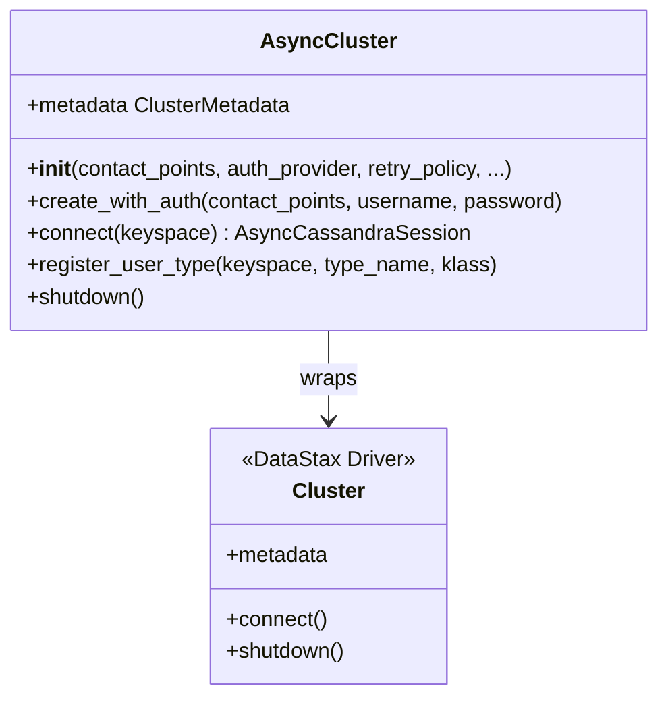
```mermaid
classDiagram
    class AsyncCluster {
        +metadata ClusterMetadata
        +__init__(contact_points, auth_provider, retry_policy, ...)
        +create_with_auth(contact_points, username, password)
        +connect(keyspace) AsyncCassandraSession
        +register_user_type(keyspace, type_name, klass)
        +shutdown()
    }

    class Cluster {
        <<DataStax Driver>>
        +connect()
        +shutdown()
        +metadata
    }

    AsyncCluster --> Cluster : wraps
```

#### 2. AsyncCassandraSession

Provides async interface for query execution:

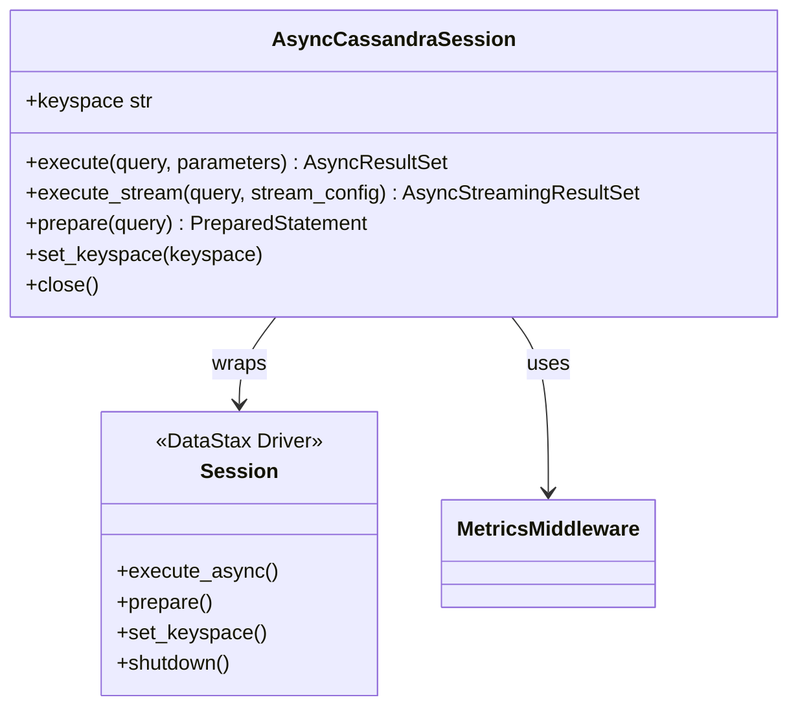
```mermaid
classDiagram
    class AsyncCassandraSession {
        +keyspace str
        +execute(query, parameters) AsyncResultSet
        +execute_stream(query, stream_config) AsyncStreamingResultSet
        +prepare(query) PreparedStatement
        +set_keyspace(keyspace)
        +close()
    }

    class Session {
        <<DataStax Driver>>
        +execute_async()
        +prepare()
        +set_keyspace()
        +shutdown()
    }

    AsyncCassandraSession --> Session : wraps
    AsyncCassandraSession --> MetricsMiddleware : uses
```

#### 3. AsyncResultSet

Provides async-friendly result iteration:

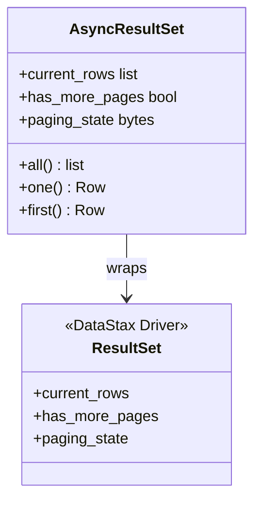
```mermaid
classDiagram
    class AsyncResultSet {
        +all() list
        +one() Row
        +first() Row
        +current_rows list
        +has_more_pages bool
        +paging_state bytes
    }

    class ResultSet {
        <<DataStax Driver>>
        +current_rows
        +has_more_pages
        +paging_state
    }

    AsyncResultSet --> ResultSet : wraps
```

### Streaming Components

#### 4. AsyncStreamingResultSet

Enables memory-efficient processing of large result sets:

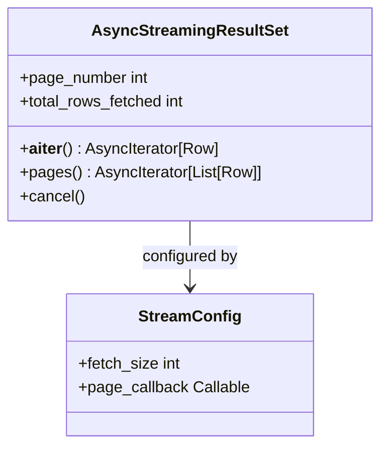
```mermaid
classDiagram
    class AsyncStreamingResultSet {
        +__aiter__() AsyncIterator[Row]
        +pages() AsyncIterator[List[Row]]
        +cancel()
        +page_number int
        +total_rows_fetched int
    }

    class StreamConfig {
        +fetch_size int
        +page_callback Callable
    }

    AsyncStreamingResultSet --> StreamConfig : configured by
```

### Metrics & Monitoring

#### 5. Metrics System

Provides comprehensive query and connection metrics:

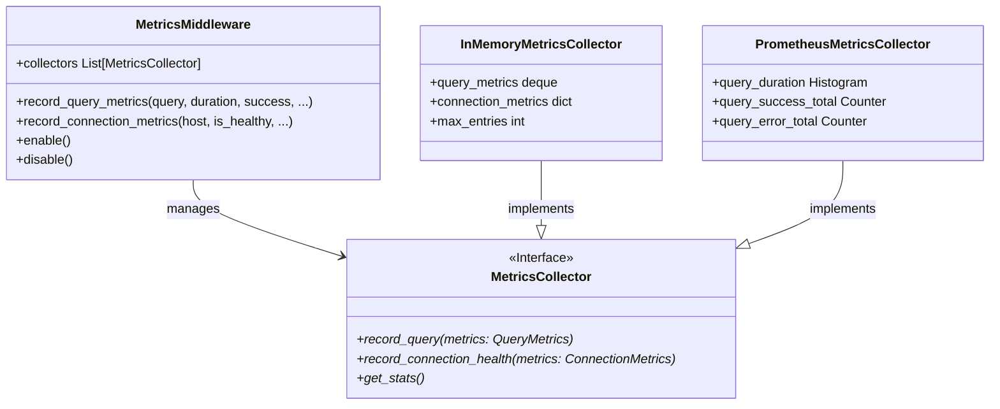
```mermaid
classDiagram
    class MetricsMiddleware {
        +collectors List[MetricsCollector]
        +record_query_metrics(query, duration, success, ...)
        +record_connection_metrics(host, is_healthy, ...)
        +enable()
        +disable()
    }

    class MetricsCollector {
        <<Interface>>
        +record_query(metrics: QueryMetrics)*
        +record_connection_health(metrics: ConnectionMetrics)*
        +get_stats()*
    }

    class InMemoryMetricsCollector {
        +query_metrics deque
        +connection_metrics dict
        +max_entries int
    }

    class PrometheusMetricsCollector {
        +query_duration Histogram
        +query_success_total Counter
        +query_error_total Counter
    }

    MetricsMiddleware --> MetricsCollector : manages
    InMemoryMetricsCollector --|> MetricsCollector : implements
    PrometheusMetricsCollector --|> MetricsCollector : implements
```

#### 6. Retry Policies

Provides idempotency-aware retry logic:

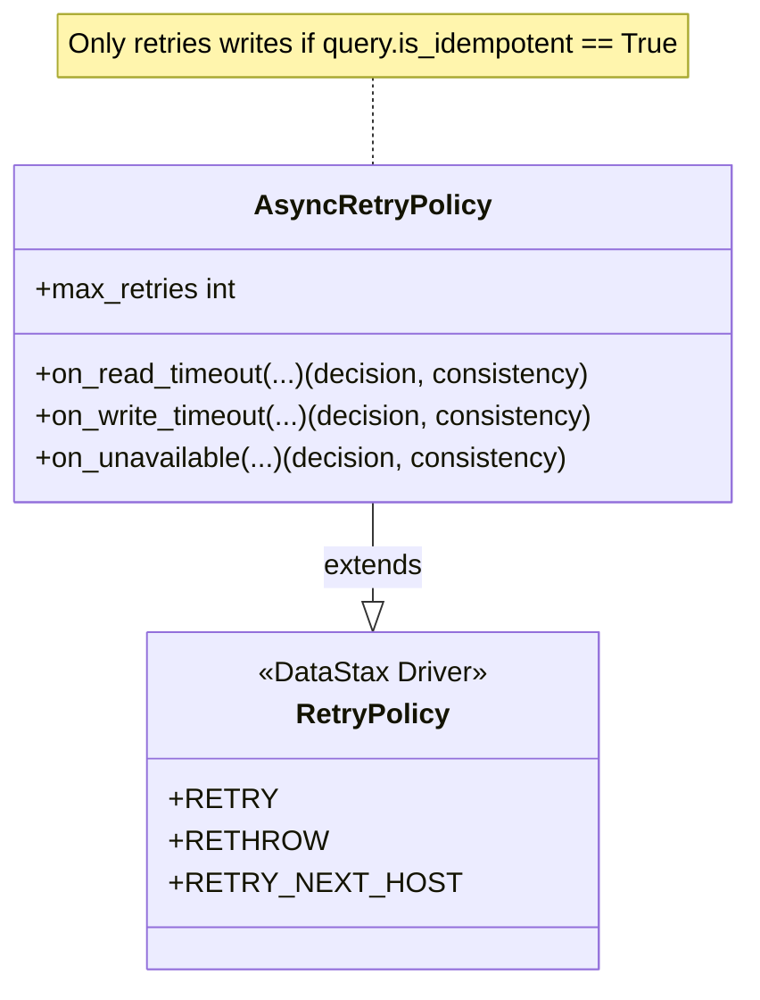
```mermaid
classDiagram
    class AsyncRetryPolicy {
        +max_retries int
        +on_read_timeout(...) (decision, consistency)
        +on_write_timeout(...) (decision, consistency)
        +on_unavailable(...) (decision, consistency)
    }

    class RetryPolicy {
        <<DataStax Driver>>
        +RETRY
        +RETHROW
        +RETRY_NEXT_HOST
    }

    AsyncRetryPolicy --|> RetryPolicy : extends

    note for AsyncRetryPolicy "Only retries writes if query.is_idempotent == True"
```

## Execution Flow

### Query Execution

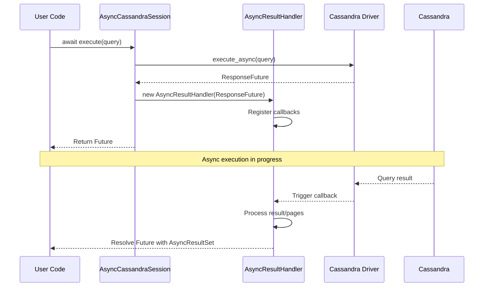
```mermaid
sequenceDiagram
    participant User as User Code
    participant Session as AsyncCassandraSession
    participant Handler as AsyncResultHandler
    participant Driver as Cassandra Driver
    participant DB as Cassandra

    User->>Session: await execute(query)
    Session->>Driver: execute_async(query)
    Driver-->>Session: ResponseFuture
    Session->>Handler: new AsyncResultHandler(ResponseFuture)
    Handler->>Handler: Register callbacks
    Session-->>User: Return Future

    Note over User,DB: Async execution in progress

    DB-->>Driver: Query result
    Driver-->>Handler: Trigger callback
    Handler->>Handler: Process result/pages
    Handler-->>User: Resolve Future with AsyncResultSet
```

### Streaming Execution

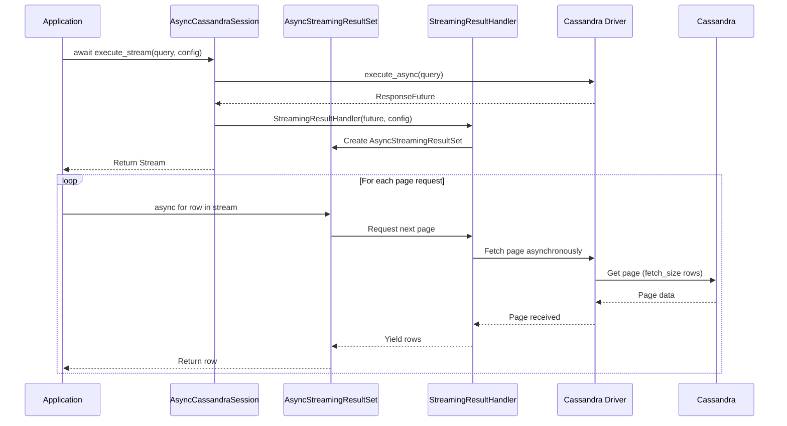
```mermaid
sequenceDiagram
    participant App as Application
    participant Session as AsyncCassandraSession
    participant Stream as AsyncStreamingResultSet
    participant Handler as StreamingResultHandler
    participant Driver as Cassandra Driver
    participant DB as Cassandra

    App->>Session: await execute_stream(query, config)
    Session->>Driver: execute_async(query)
    Driver-->>Session: ResponseFuture
    Session->>Handler: StreamingResultHandler(future, config)
    Handler->>Stream: Create AsyncStreamingResultSet
    Session-->>App: Return Stream

    loop For each page request
        App->>Stream: async for row in stream
        Stream->>Handler: Request next page
        Handler->>Driver: Fetch page asynchronously
        Driver->>DB: Get page (fetch_size rows)
        DB-->>Driver: Page data
        Driver-->>Handler: Page received
        Handler-->>Stream: Yield rows
        Stream-->>App: Return row
    end
```

### Batch Operations

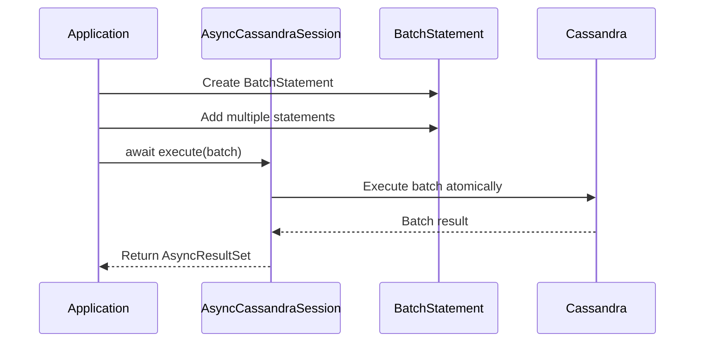
```mermaid
sequenceDiagram
    participant App as Application
    participant Session as AsyncCassandraSession
    participant Batch as BatchStatement
    participant DB as Cassandra

    App->>Batch: Create BatchStatement
    App->>Batch: Add multiple statements
    App->>Session: await execute(batch)
    Session->>DB: Execute batch atomically
    DB-->>Session: Batch result
    Session-->>App: Return AsyncResultSet
```

### Connection Pooling

For detailed information about connection pooling behavior, limitations, and best practices, see our [Connection Pooling Documentation](connection-pooling.md).

Key points:
- Protocol v3+ uses one TCP connection per host
- Each connection supports up to 32,768 concurrent requests
- Python driver behavior differs from Java/C++ drivers due to GIL

## Performance Considerations

### 1. Connection Pool Efficiency

The async wrapper maintains the driver's connection pooling:

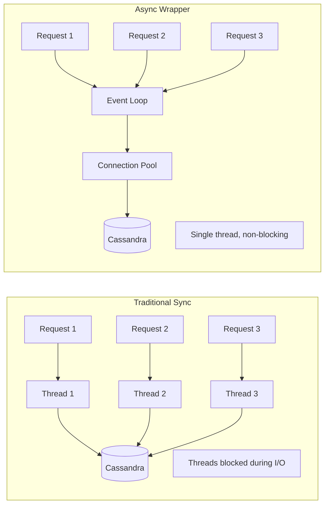
```mermaid
graph LR
    subgraph "Traditional Sync"
        S1[Request 1] --> T1[Thread 1]
        S2[Request 2] --> T2[Thread 2]
        S3[Request 3] --> T3[Thread 3]
        T1 --> DB1[(Cassandra)]
        T2 --> DB1
        T3 --> DB1
        Note1[Threads blocked during I/O]
    end

    subgraph "Async Wrapper"
        A1[Request 1] --> EL[Event Loop]
        A2[Request 2] --> EL
        A3[Request 3] --> EL
        EL --> CP[Connection Pool]
        CP --> DB2[(Cassandra)]
        Note2[Single thread, non-blocking]
    end
```

### 2. Concurrency Model

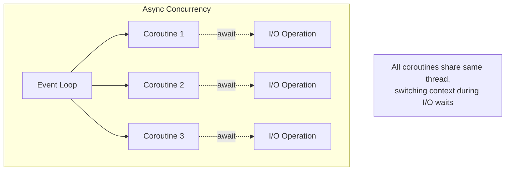
```mermaid
graph TB
    subgraph "Async Concurrency"
        EL[Event Loop]
        C1[Coroutine 1]
        C2[Coroutine 2]
        C3[Coroutine 3]

        EL --> C1
        EL --> C2
        EL --> C3

        C1 -.->|await| IO1[I/O Operation]
        C2 -.->|await| IO2[I/O Operation]
        C3 -.->|await| IO3[I/O Operation]
    end

    Note[All coroutines share same thread,<br/>switching context during I/O waits]
```

### 3. Resource Usage Comparison

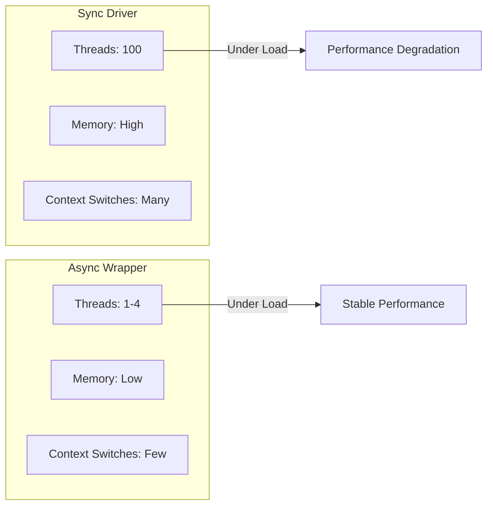
```mermaid
graph LR
    subgraph "Sync Driver"
        direction TB
        ST[Threads: 100]
        SM[Memory: High]
        SC[Context Switches: Many]
    end

    subgraph "Async Wrapper"
        direction TB
        AT[Threads: 1-4]
        AM[Memory: Low]
        AC[Context Switches: Few]
    end

    ST --> |"Under Load"| SP[Performance Degradation]
    AT --> |"Under Load"| AP[Stable Performance]
```

## Best Practices

1. **Connection Management**: Create cluster and session at application startup
2. **Prepared Statements**: Use prepared statements for repeated queries
3. **Batch Operations**: Group related writes for better performance
4. **Error Handling**: Implement proper retry logic for transient failures
5. **Resource Cleanup**: Always close sessions and clusters properly

## Integration with FastAPI

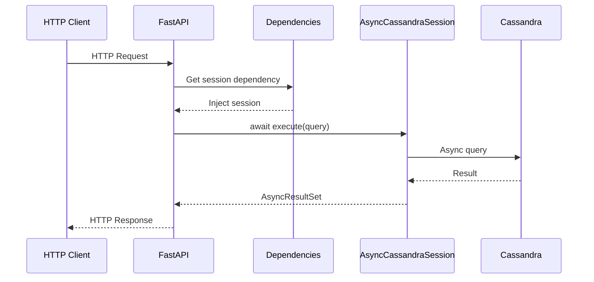
```mermaid
sequenceDiagram
    participant Client as HTTP Client
    participant FastAPI as FastAPI
    participant Deps as Dependencies
    participant Session as AsyncCassandraSession
    participant DB as Cassandra

    Client->>FastAPI: HTTP Request
    FastAPI->>Deps: Get session dependency
    Deps-->>FastAPI: Inject session
    FastAPI->>Session: await execute(query)
    Session->>DB: Async query
    DB-->>Session: Result
    Session-->>FastAPI: AsyncResultSet
    FastAPI-->>Client: HTTP Response
```

This architecture enables efficient, scalable applications that can handle thousands of concurrent requests without the thread pool bottlenecks of traditional synchronous drivers.

## Architectural Patterns

### Base Class Hierarchy

async-cassandra uses a consistent base class pattern for resource management:

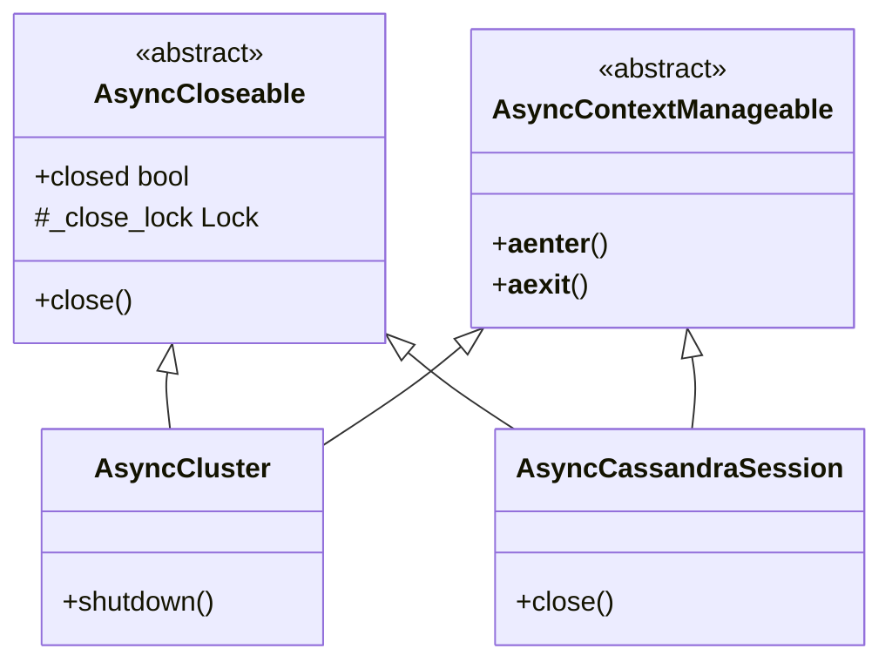
```mermaid
classDiagram
    class AsyncCloseable {
        <<abstract>>
        +close()
        +closed bool
        #_close_lock Lock
    }

    class AsyncContextManageable {
        <<abstract>>
        +__aenter__()
        +__aexit__()
    }

    class AsyncCluster {
        +shutdown()
    }

    class AsyncCassandraSession {
        +close()
    }

    AsyncCloseable <|-- AsyncCluster
    AsyncCloseable <|-- AsyncCassandraSession
    AsyncContextManageable <|-- AsyncCluster
    AsyncContextManageable <|-- AsyncCassandraSession
```

### Middleware Pattern

The metrics system uses a middleware pattern for extensibility:

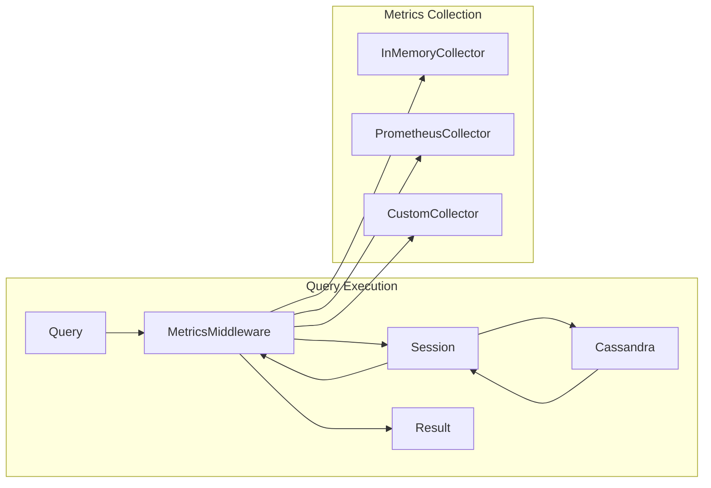
```mermaid
graph LR
    subgraph "Query Execution"
        Q[Query] --> MW[MetricsMiddleware]
        MW --> S[Session]
        S --> C[Cassandra]
        C --> S
        S --> MW
        MW --> R[Result]
    end

    subgraph "Metrics Collection"
        MW --> MC1[InMemoryCollector]
        MW --> MC2[PrometheusCollector]
        MW --> MC3[CustomCollector]
    end
```

### Handler Pattern

Result processing uses specialized handlers for different result types:

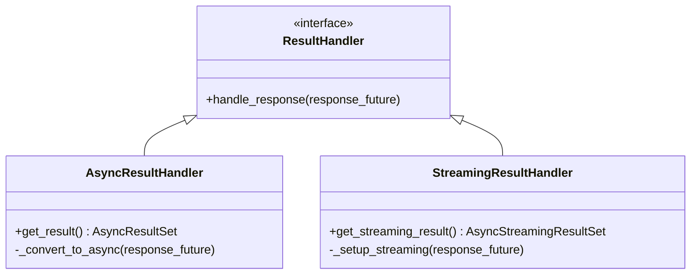
```mermaid
classDiagram
    class ResultHandler {
        <<interface>>
        +handle_response(response_future)
    }

    class AsyncResultHandler {
        +get_result() AsyncResultSet
        -_convert_to_async(response_future)
    }

    class StreamingResultHandler {
        +get_streaming_result() AsyncStreamingResultSet
        -_setup_streaming(response_future)
    }

    ResultHandler <|-- AsyncResultHandler
    ResultHandler <|-- StreamingResultHandler
```

### Error Handling Strategy

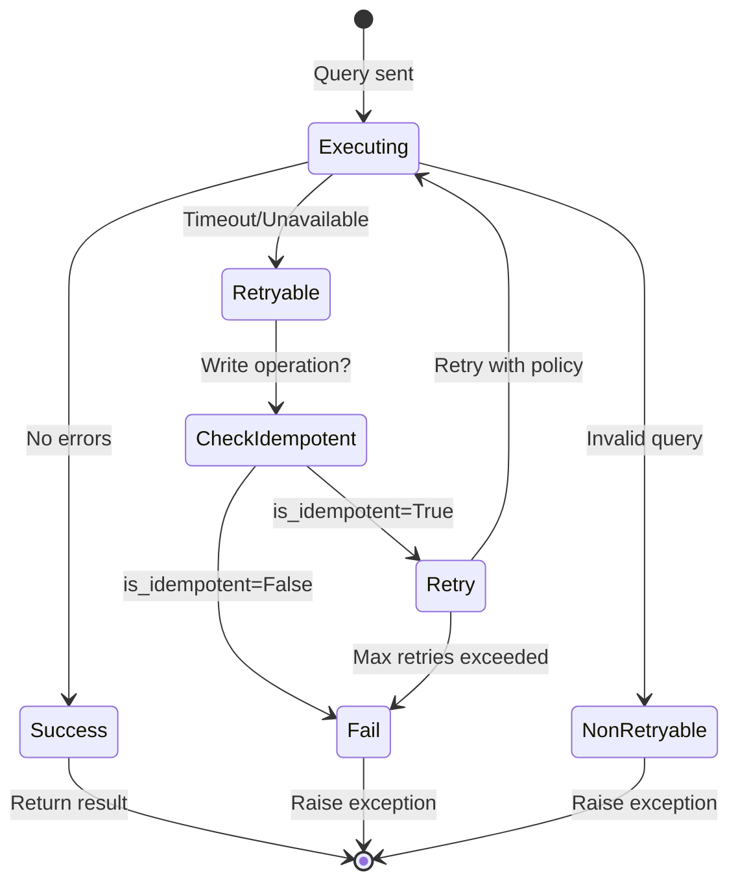
```mermaid
stateDiagram-v2
    [*] --> Executing: Query sent
    Executing --> Success: No errors
    Executing --> Retryable: Timeout/Unavailable
    Executing --> NonRetryable: Invalid query

    Retryable --> CheckIdempotent: Write operation?
    CheckIdempotent --> Retry: is_idempotent=True
    CheckIdempotent --> Fail: is_idempotent=False

    Retry --> Executing: Retry with policy
    Retry --> Fail: Max retries exceeded

    Success --> [*]: Return result
    Fail --> [*]: Raise exception
    NonRetryable --> [*]: Raise exception
```

These architectural patterns ensure:
- Consistent resource management across all components
- Extensible metrics and monitoring capabilities
- Safe retry behavior with idempotency checking
- Clear separation of concerns between different result types
