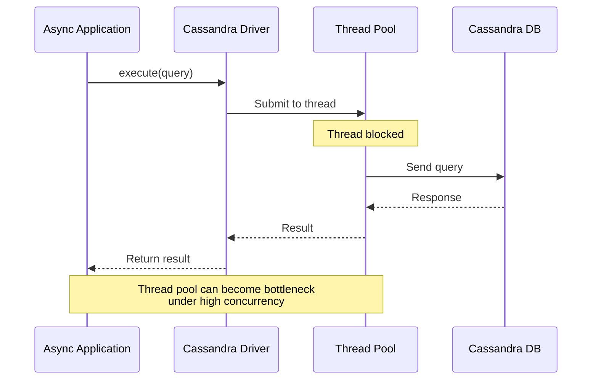
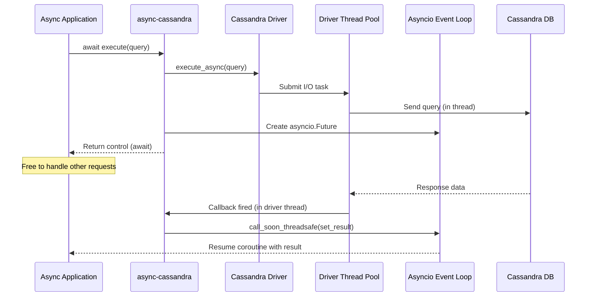
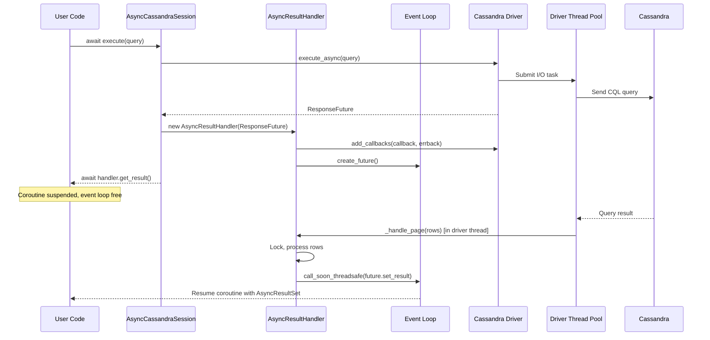
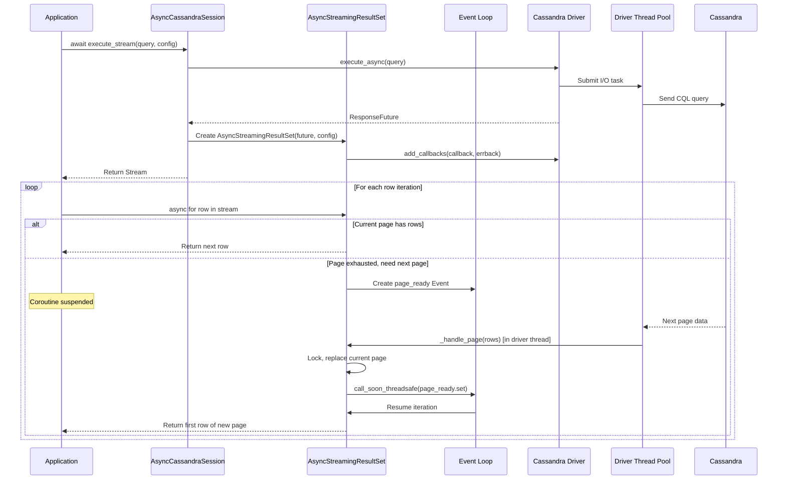

# Architecture Overview

This document provides a high-level overview of how async-cassandra bridges the gap between the synchronous DataStax Cassandra driver and Python's async/await ecosystem.

## Table of Contents

- [Problem Statement](#problem-statement)
- [Solution Architecture](#solution-architecture)
- [Key Components](#key-components)
- [Execution Flow](#execution-flow)
  - [Query Execution](#query-execution)
  - [Streaming Execution](#streaming-execution)
- [Design Principles](#design-principles)

## Problem Statement

The DataStax Cassandra Python driver uses a thread pool for I/O operations, which can create bottlenecks in async applications:



## Solution Architecture

async-cassandra bridges the gap between the DataStax driver's thread-based callbacks and Python's asyncio event loop. Here's how it actually works:

### The Bridge Pattern

The DataStax driver uses a ThreadPoolExecutor for I/O operations and callbacks. We don't replace this - instead, we bridge between the driver's threading model and asyncio:



### Key Implementation Details

1. **We DON'T create our own thread pool** - we use the driver's existing ThreadPoolExecutor
2. **Thread-safe communication** - Callbacks from driver threads use `call_soon_threadsafe()` to safely communicate with the asyncio event loop
3. **Futures bridging** - We create asyncio Futures that are resolved by callbacks from driver threads

## How the Bridge Works: Code Deep Dive

### 1. Query Execution Flow

When you call `await session.execute(query)`, here's what happens:

```python
# In AsyncCassandraSession.execute() - src/async_cassandra/session.py:156-168
response_future = self._session.execute_async(
    query, parameters, trace, custom_payload, timeout,
    execution_profile, paging_state, host, execute_as
)

handler = AsyncResultHandler(response_future)
result = await handler.get_result(timeout=query_timeout)
```

The DataStax driver's `execute_async()` returns a `ResponseFuture` that will be completed by a driver thread.

### 2. The Bridge: AsyncResultHandler

The magic happens in `AsyncResultHandler` ([src/async_cassandra/result.py](../src/async_cassandra/result.py)):

```python
class AsyncResultHandler:
    def __init__(self, response_future: ResponseFuture):
        self.response_future = response_future
        self.rows: List[Any] = []
        self._future: Optional[asyncio.Future[AsyncResultSet]] = None
        self._lock = threading.Lock()  # Thread safety!

        # Register callbacks with the driver
        self.response_future.add_callbacks(
            callback=self._handle_page,
            errback=self._handle_error
        )
```

### 3. Thread-Safe Callback Handling

When the driver completes the query (in a driver thread), our callback is invoked:

```python
def _handle_page(self, rows: List[Any]) -> None:
    """Called from driver thread - must be thread-safe!"""
    with self._lock:
        if rows is not None:
            self.rows.extend(list(rows))  # Defensive copy

        if self.response_future.has_more_pages:
            self.response_future.start_fetching_next_page()
        else:
            # All done - notify the asyncio Future
            final_result = AsyncResultSet(list(self.rows), self.response_future)

            if self._future and not self._future.done():
                loop = getattr(self, "_loop", None)
                if loop:
                    # CRITICAL: Use call_soon_threadsafe to bridge threads!
                    loop.call_soon_threadsafe(self._future.set_result, final_result)
```

### 4. The Asyncio Side

Meanwhile, the asyncio coroutine is waiting:

```python
async def get_result(self, timeout: Optional[float] = None) -> "AsyncResultSet":
    # Create asyncio Future in the current event loop
    loop = asyncio.get_running_loop()
    self._future = loop.create_future()
    self._loop = loop  # Store for callbacks to use

    # Wait for the driver thread to complete
    if timeout is not None:
        return await asyncio.wait_for(self._future, timeout=timeout)
    else:
        return await self._future
```

### 5. Driver Thread Pool Configuration

The driver's thread pool size is configurable ([src/async_cassandra/cluster.py](../src/async_cassandra/cluster.py)):

```python
def __init__(self, ..., executor_threads: int = 2, ...):
    # This is passed to the DataStax Cluster constructor
    # The driver creates: ThreadPoolExecutor(max_workers=executor_threads)
```

**Important**: This thread pool is shared for ALL I/O operations, so under high concurrency, you may need to increase `executor_threads`.

## Key Components

### AsyncCluster
- Wraps the DataStax `Cluster` class
- Manages cluster lifecycle (connect, shutdown)
- Provides async context manager support
- Handles authentication and configuration

### AsyncCassandraSession
- Wraps the DataStax `Session` class
- Converts synchronous operations to async/await
- Provides streaming support for large result sets
- Integrates with metrics collection

### AsyncResultSet
- Wraps query results for async consumption
- Handles paging transparently
- Provides familiar result access methods (one(), all())

### AsyncStreamingResultSet
- Enables memory-efficient processing of large results
- Supports async iteration over rows
- Provides page-level access for batch processing
- Includes progress tracking capabilities

## Execution Flow

### Query Execution

The following diagram shows how a standard query flows through the async wrapper:



### Streaming Execution

For large result sets, streaming provides memory-efficient processing:



## Design Principles

### 1. Thin Wrapper Approach
- We wrap, not reimplement, the DataStax driver
- All driver features remain accessible
- Minimal performance overhead

### 2. True Async/Await Support
- All blocking operations converted to async
- Proper integration with Python's event loop
- No blocking of the event loop

### 3. Memory Efficiency
- Streaming support for large result sets
- Configurable fetch sizes
- Page-based processing options

### 4. Developer Experience
- Familiar async/await syntax
- Context manager support
- Type hints throughout

### 5. Production Ready
- Comprehensive error handling
- Metrics and monitoring built-in
- Battle-tested retry policies

## Thread Pool Architecture Summary

### The Two Worlds

async-cassandra bridges two distinct execution environments:

1. **Asyncio World** (Your Application)
   - Single-threaded event loop
   - Coroutines and async/await
   - Non-blocking I/O via event loop
   - Can handle thousands of concurrent operations

2. **Driver Thread Pool World** (DataStax Driver)
   - ThreadPoolExecutor with `executor_threads` workers (default: 2)
   - Blocking I/O operations
   - Callback-based completion
   - Limited by thread count

### The Bridge Mechanism

We don't "map" thread pools - we **bridge** between them:

```
Your Async Code → asyncio.Future → Callback Bridge → Driver ResponseFuture → Thread Pool
                       ↑                                                          ↓
                       └──────── call_soon_threadsafe() ←──────────────────────┘
```

Key bridging components:
- **asyncio.Future**: Created in the event loop, awaited by your code
- **ResponseFuture**: Created by the driver, completed by driver threads
- **Callbacks**: Registered with ResponseFuture, called from driver threads
- **call_soon_threadsafe()**: The critical method that safely notifies the event loop from driver threads

### Performance Implications

Since we use the driver's thread pool:
- Maximum concurrent I/O operations = `executor_threads` (default: 2)
- Under high load, increase `executor_threads` when creating the cluster
- Each blocking operation ties up a thread until completion
- The event loop stays free, but total throughput is limited by thread count

## Important Limitations

While async-cassandra provides async/await syntax, it's important to understand:

1. **The underlying I/O is still synchronous** - The DataStax driver uses blocking sockets in threads
2. **Thread pool constraints apply** - Concurrency is limited by the driver's thread pool size (default: 2 threads)
3. **Not a true async driver** - This is a compatibility layer, not a ground-up async implementation
4. **No thread pool multiplication** - We use the driver's thread pool as-is, we don't add additional threads

For more details on these limitations and when to use this wrapper, see [Why an Async Wrapper is Necessary](why-async-wrapper.md).
